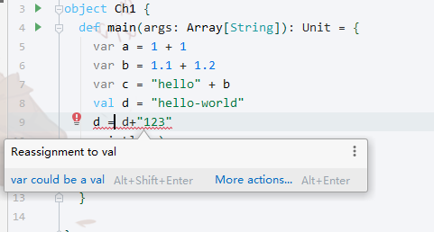

# Scala 变量

## 变量类型(基础变量类型)

- Byte
- Short
- Int
- Long
- Float
- Double
- Char
- String
- Boolean
上述部分在Java中会经常使用不做介绍
- Unit : 类似Java中`void`关键字
- AnyRef:AnyRef类是Scala里所有引用类(reference class)的基类
- Any:Any是所有其他类的超类
- Null: null 或者空引用
- Nothing:	Nothing类型在Scala的类层级的最低端；它是任何其他类型的子类型

## 变量声明
var[val] 变量名称:变量类型=变量值

## 类型的强制转换
- .toXXX
```scala
  def toByte: Byte
  def toShort: Short
  def toChar: Char
  def toInt: Int
  def toLong: Long
  def toFloat: Float
  def toDouble: Double
```
```scala
var e: Int = 2.3.toInt
println(e)
```
- 类型不同复制失败
    - type mismatch;
```scala
var e: Int = 2.3.toInt
println(e)
e = 3.4
```
## 基本运算
+,-,*,/,%,<<,>>,|,&
变量.操作符(变量)
```scala
    var e: Int = 2.3.toInt
    println(e)
    val i = e.+(1)
    println(i)
    println(i.<<(1))
```

## var 和 val 
- `var` 可变变量
- `val` 不可变量 , 类似Java的`final`
  - val想要再次进行赋值会提示如下异常



## apply 方法
- 以String举例,`StringOps`这个类是Scala对Java`String`的增强
```scala
final class StringOps(override val repr: String) extends AnyVal with StringLike[String] {

  override protected[this] def thisCollection: WrappedString = new WrappedString(repr)
  override protected[this] def toCollection(repr: String): WrappedString = new WrappedString(repr)

  /** Creates a string builder buffer as builder for this class */
  override protected[this] def newBuilder = StringBuilder.newBuilder

  override def apply(index: Int): Char = repr charAt index
  override def slice(from: Int, until: Int): String = {
    val start = if (from < 0) 0 else from
    if (until <= start || start >= repr.length)
      return ""

    val end = if (until > length) length else until
    repr.substring(start, end)
  }
  override def toString = repr
  override def length = repr.length

  def seq = new WrappedString(repr)
}
```
- 查看代码可以发现apply()方法指向了charAt 传递了参数index`  override def apply(index: Int): Char = repr charAt index`那么`charAt(int index)`做了什么呢?
  - `java.lang.String.charAt`真正执行的方法,该方法执行效果:获取第index的字符

- Scala String Apply
```scala
val d = "hello-world"
println(d.apply(10))
// 输出字符d
```

## 相关代码
```scala
package com.huifer

/**
 * 变量
 */
object Variate {
  def main(args: Array[String]): Unit = {
    //    var a = 1;
    var a: Int = 1
    a = 1 + 1
    var b = 1.1 + 1.2
    var c = "hello" + b
    val d = "hello-world"
    println(a)
    println(b)
    println(c)
    var e: Int = 2.3.toInt
    println(e)
    val i = e.+(1)
    println(i)
    println(i.<<(1))
    println(d.apply(10))
  }

}
```