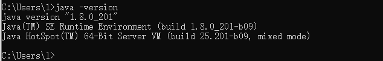
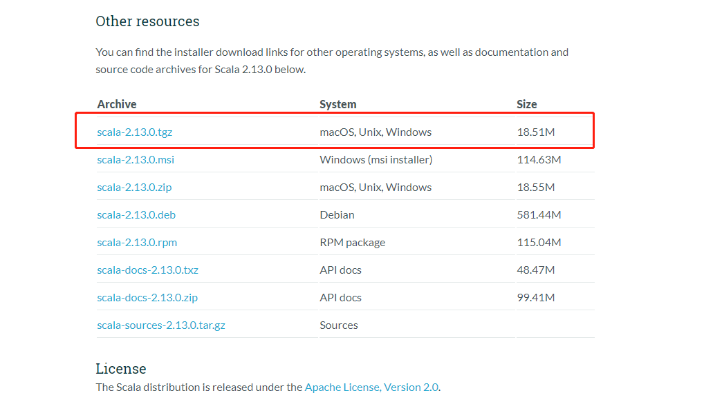
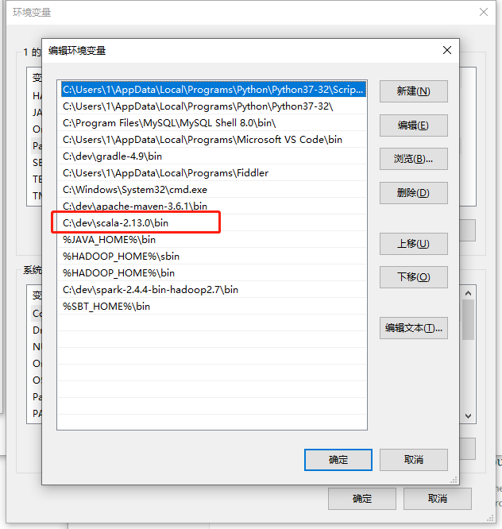
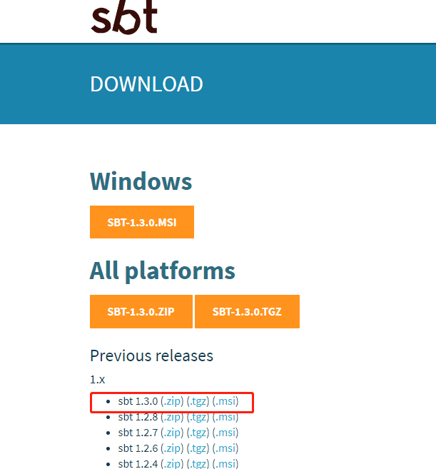
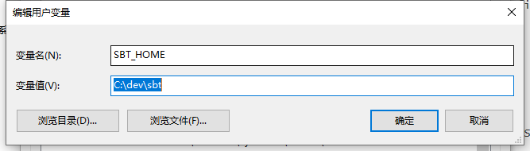
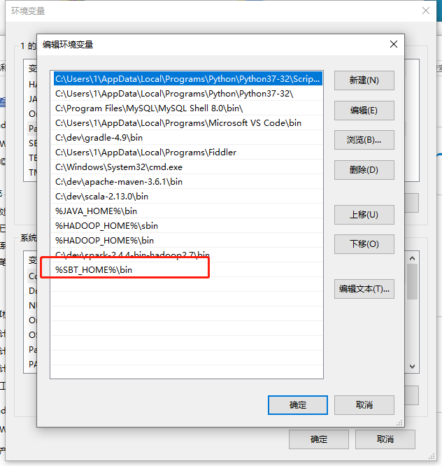
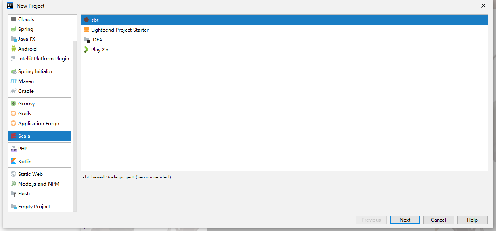
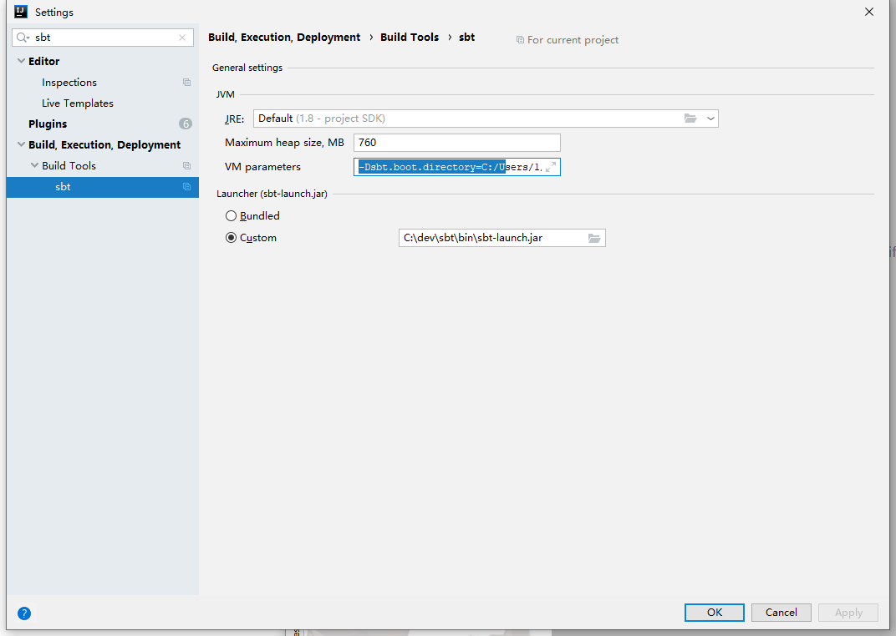
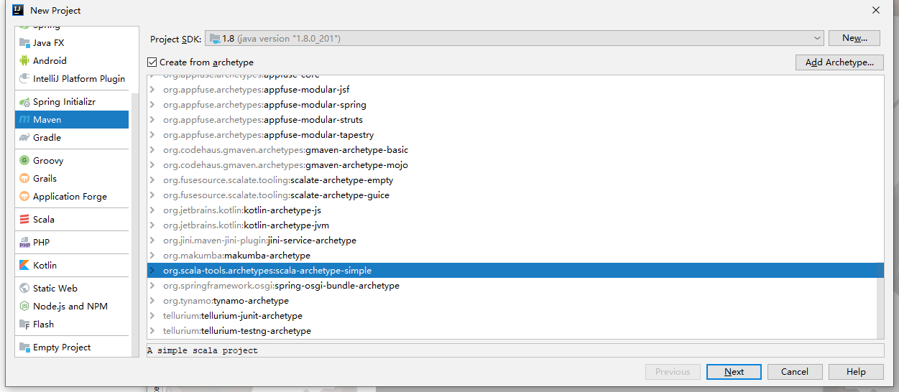

# Hello Scala 
## Scala 官网
- [Scala-lang](https://www.scala-lang.org/)
## 环境开始
- 环境搭建需要JDK8的支持请先安装JDK8

  

- [下载地址](https://www.scala-lang.org/download/)

  

- 解压后配置环境变量

  

## SBT

- Java有Maven 和 Gradle等构建工具Scala同样也有，[官网](https://www.scala-sbt.org/)

  

- 下载解压后修改配置信息，在conf目录下创建`repo.properties`文件来存放仓库信息内容如下

  ```properties
  [repositories]  
    local
    Nexus osc : https://code.lds.org/nexus/content/groups/main-repo
    Nexus osc thirdparty : https://code.lds.org/nexus/content/groups/plugin-repo/
    typesafe: http://repo.typesafe.com/typesafe/ivy-releases/, [organization]/[module]/(scala_[scalaVersion]/)(sbt_[sbtVersion]/)[revision]/[type]s/[artifact](-[classifier]).[ext], bootOnly  
    typesafe2: http://repo.typesafe.com/typesafe/releases/
    sbt-plugin: http://repo.scala-sbt.org/scalasbt/sbt-plugin-releases/
    sonatype: http://oss.sonatype.org/content/repositories/snapshots  
    uk_maven: http://uk.maven.org/maven2/  
    ibibli: http://mirrors.ibiblio.org/maven2/  
    repo2: http://repo2.maven.org/maven2/
   
    comp-maven:http://mvnrepository.com/artifact/
    store_cn:http://maven.oschina.net/content/groups/public/
    store_mir:http://mirrors.ibiblio.org/maven2/
    store_0:http://maven.net.cn/content/groups/public/
    store_1:http://repo.typesafe.com/typesafe/ivy-releases/
    store_2:http://repo2.maven.org/maven2/
   
    sbt-releases-repo: http://repo.typesafe.com/typesafe/ivy-releases/, [organization]/[module]/(scala_[scalaVersion]/)(sbt_[sbtVersion]/)[revision]/[type]s/[artifact](-[classifier]).[ext]
    sbt-plugins-repo: http://repo.scala-sbt.org/scalasbt/sbt-plugin-releases/, [organization]/[module]/(scala_[scalaVersion]/)(sbt_[sbtVersion]/)[revision]/[type]s/[artifact](-[classifier]).[ext]
    maven-central: http://repo1.maven.org/maven2/
  ```

- 继续修改`sbtconfig.txt`文件

  ```tex
  # sbt configuration file for Windows
  
  # Set the java args
  
  -Xms1024m
  -Xmx1024m
  -Xss4M
  -XX:ReservedCodeCacheSize=128m
  
  # Set the extra sbt options
  
  # -Dsbt.log.format=true
  -Dsbt.boot.directory=C:/Users/1/.sbt/boot
  -Dsbt.ivy.home=C:/Users/1/.ivy2
  -Dsbt.global.base=C:/Users/1/.sbt/boot
  
  -Dsbt.repository.config=C:/dev/sbt/repo.properties
  
  ```

  

- 同样需要放入path中

  

  


## IDEA 插件安装

- [Scala-plugin](https://plugins.jetbrains.com/plugin/1347-scala)

  安装后在新建项目可见如下图所示

  

- IDEA sbt配置

  

  - VM parameters 填写配置文件中内容

    ```
    -Dsbt.boot.directory=C:/Users/1/.sbt/boot
    -Dsbt.ivy.home=C:/Users/1/.ivy2
    -Dsbt.global.base=C:/Users/1/.sbt/boot
    -Dsbt.repository.config=C:/dev/sbt/repo.properties
    ```

  - launcher 选择sbt-launch.jar即可


## 项目创建

- 使用SBT创建

  

  一直下一步即可完成

- 使用maven创建

  

  一直下一步即可完成安装


## hello-world

```scala
object MyRouteMain extends RouteBuilderSupport {

  def main(args: Array[String]): Unit = {
    println("hello-world")
  }
}
```

运行后可以在控制台看到

```
hello-world
```

